# JAGENTS Agents MCP Server - Workflow Sequence Diagrams

## Overview

This document provides comprehensive sequence diagrams for all JAGENTS agent workflows, showing how agents interact and data flows through the Agile method phases.

---

## Complete Agile Method Workflow

---

## Phase 1: Ideation (Analyst)

```mermaid
sequenceDiagram
    participant User
    participant Analyst
    participant SixHats as Six Thinking Hats
    participant FiveWs as Five W's
    
    User->>Analyst: userIdea + context
    
    alt Six Thinking Hats Workflow
        Analyst->>SixHats: Analyze idea
        SixHats->>SixHats: White Hat (Facts)
        SixHats->>SixHats: Red Hat (Emotions)
        SixHats->>SixHats: Black Hat (Risks)
        SixHats->>SixHats: Yellow Hat (Benefits)
        SixHats->>SixHats: Green Hat (Creativity)
        SixHats->>SixHats: Blue Hat (Process)
        SixHats-->>Analyst: Multi-perspective analysis
    else Five W's Workflow
        Analyst->>FiveWs: Analyze idea
        FiveWs->>FiveWs: Who (Stakeholders)
        FiveWs->>FiveWs: What (Problem/Solution)
        FiveWs->>FiveWs: Where (Context)
        FiveWs->>FiveWs: When (Timeline)
        FiveWs->>FiveWs: Why (Purpose)
        Five Ws-->>Analyst: Structured analysis
    end
    
    Analyst->>Analyst: Synthesize insights
    Analyst->>Analyst: Generate Project Brief
    Analyst-->>User: Project Brief (→ Phase 2)
```

---

## Phase 2: Requirements (Product Manager)

```mermaid
sequenceDiagram
    participant User
    participant PM as Product Manager
    participant SAP as Scale-Adaptive Planning
    
    User->>PM: projectBrief
    
    PM->>SAP: Analyze project scope
    SAP->>SAP: Calculate complexity score
    
    alt Quick Flow (<2 weeks)
        SAP-->>PM: Select quick-flow track
        PM->>PM: Generate lightweight PRD
        PM-->>User: Quick PRD
    else Agile Standard (2-12 weeks)
        SAP-->>PM: Select agile-standard track
        PM->>PM: Generate standard PRD
        PM->>PM: Define sprints
        PM-->>User: Full PRD with roadmap
    else Enterprise (12+ weeks)
        SAP-->>PM: Select enterprise track
        PM->>PM: Generate comprehensive GDD
        PM->>PM: Define phases & milestones
        PM-->>User: Game Design Document
    end
    
    PM-->>User: Requirements (→ Phase 3)
```

---

## Phase 3: Architecture (Architect + Security)

```mermaid
sequenceDiagram
    participant User
    participant Arch as Architect
    participant SA as Security Architect
    participant CSO
    
    User->>Arch: prd + requirements
    
    Arch->>Arch: Detect project type
    Note over Arch: API/Mobile/Web/ML/etc.
    
    Arch->>Arch: Select tech stack
    Arch->>Arch: Generate architecture
    
    Arch->>SA: Request security design
    SA->>SA: Apply Zero Trust principles
    SA->>SA: STRIDE threat modeling
    SA->>SA: Generate security controls
    SA->>SA: Generate BDD stories
    SA-->>Arch: Security architecture + BDD stories
    
    opt Executive Review
        SA->>CSO: Security concerns
        CSO->>CSO: Prioritize BDD stories by risk
        CSO-->>SA: Strategic priorities
    end
    
    Arch->>Arch: Integrate security
    Arch-->>User: Architecture Document (→ Phase 4)
```

---

## Phase 4: Design & Planning (UX + Scrum Master)

---

## Phase 5: Implementation (Developer)

---

## Phase 6: Testing & Validation

---

## Security Workflow (BDD-Enhanced)

---

## BDD Security Testing Workflow

---

## Agent Interaction Matrix

| Phase | Primary Agent | Supporting Agents | Output | Next Phase Input |
|-------|--------------|-------------------|--------|------------------|
| 1️⃣ Ideation | Analyst | - | Project Brief | PM |
| 2️⃣ Requirements | Product Manager | - | PRD/GDD | Architect, UX |
| 3️⃣ Architecture | Architect | Security Architect, CSO | Architecture Doc | UX, Scrum Master, Developer |
| 4️⃣ Design | UX Designer, Scrum Master | - | UX Design + Stories | Developer |
| 5️⃣ Implementation | Developer | Security Architect | Code + Guidance | TEA, STA |
| 6️⃣ Testing | Test Architect, Security Test Analyst | Security Architect | Test Reports | Deployment |
| 🔒 Security (Continuous) | Security Architect, STA, CSO | All agents | Security posture | All phases |

---

## Data Flow Diagram

---

## Integration Points

### Gemini CLI Workflow

---

## Notes

- All diagrams created with Mermaid
- Sequence diagrams show temporal flow
- Data flow diagrams show information movement
- Security is integrated throughout, not just Phase 6
- BDD methodology enables automated testing and compliance validation

---

**Version:** 1.1  
**Last Updated:** 2024-12-24  
**License:** MIT
